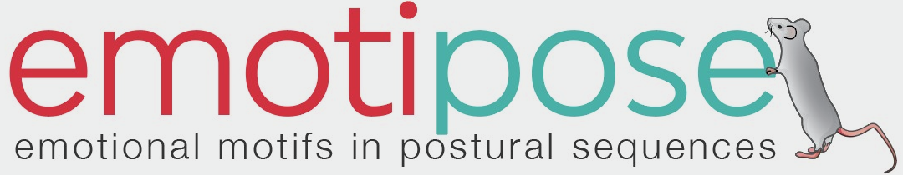
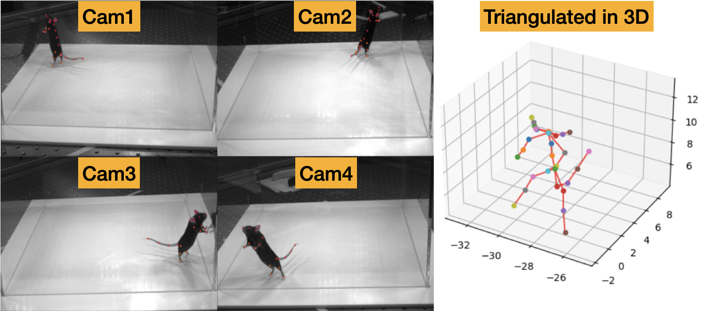
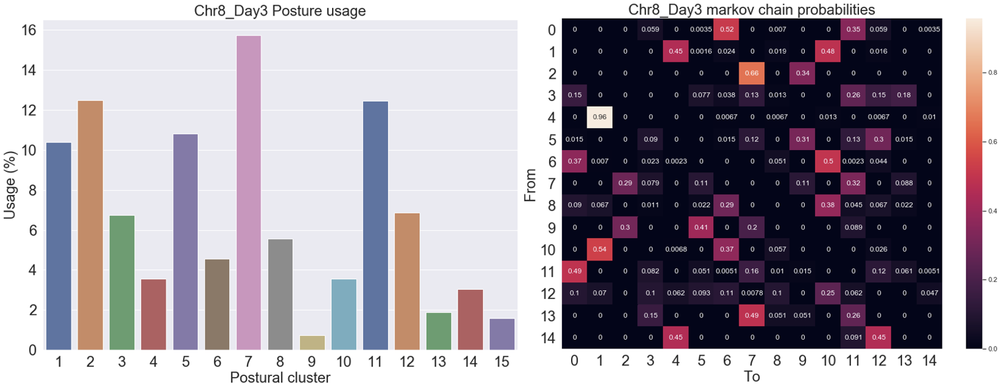

#### An open-source Python library for deep analysis of animal behaviour.
The project is discontinued and the code is not maintained anymore.
The code is provided as-is and may require significant expertise of the dependency libraries and the conceptual framework of neuroscientific analysis of animal behavior.
Should you need help, feel free to open an issue and I will do my best to provide guidance within my capabilities.

It relies on following packages:
- [campy](https://github.com/onurserce/campy/tree/flir) for video acquisition from an arbitrary number of Flir/Basler machine-vision cameras with hardware accelerated encoding (CPU or Nvidia GPU)
- [DeepLabCut](https://www.mackenziemathislab.org/deeplabcut) for markerless pose estimation
- [argus](https://argus.web.unc.edu/) for wand calibration of cameras and triangulation of keypoints to 3D space
- [VAME](https://github.com/EthoML/VAME) for identifying behavioral signals from pose-timeseries data (alternatively, use other nonlinear dimensionality reduction methods with clustering algorithms to capture stereotyped postures)
- [scikit-image](https://scikit-image.org/), [scikit-learn](https://scikit-learn.org/stable/), [scipy](https://scipy.org/) and [statsmodels](https://www.statsmodels.org/stable/index.html) for image processing, machine learning and statistics

## Installation

No setup script is provided. Clone the repository and install the dependencies.
Anaconda/miniconda or venv environment is recommended.

## Usage

### 1) Prepare videos
Cut, trim, encode, resize, downsample, etc. your videos to a common format and resolution that suits your needs.
Most of these functionality is now provided by the new version of DLC, however, there are some functions to draw arbitrary shapes (lines, circles, polygons etc.) on the video frames in the preprocessing folder, should you need it.

### 2) Train a pose estimation model
Refer to the DLC documentation for the training and inference process.

### 3) Create the 3D space
To create the 3D space, you need to calibrate the cameras and triangulate a set of keypoints that are stable (meaning that there is no variation caused by machine inference). For this, I've built a calibration wand with two LEDs using a chopstick, syringe, and a battery:

Afterwards, use the `WandCalibration` module to calibrate the cameras and triangulate the keypoints. The wand should be visible in all cameras. The calibration module will output 3D coordinates relative to a camera or point of your choice.

### 4) Analyze the data
Use the `VAME` module and traditional machine learning approaches to analyze the data. `VAME` will output a set of behavioral postures that can be used for further analysis (e.g. timeseries modeling of postural syllables, model building, statistical analysis etc.).

### Acknowledgements
- This project was developed in the lab of [Nadine Gogolla](https://www.mackenziemathislab.org/) at Max Planck Institute of Biological Intelligence (former Neurobiology) during my M.Sc. thesis and further developed (into 3D) during my PhD. 
- Thanks to [Nejc Dolensek](https://github.com/NDolensek) for his help with building the acquisition computer and the fruitful discussions.
- Thanks to Stoyo Karamihalev for the emotipose logo.